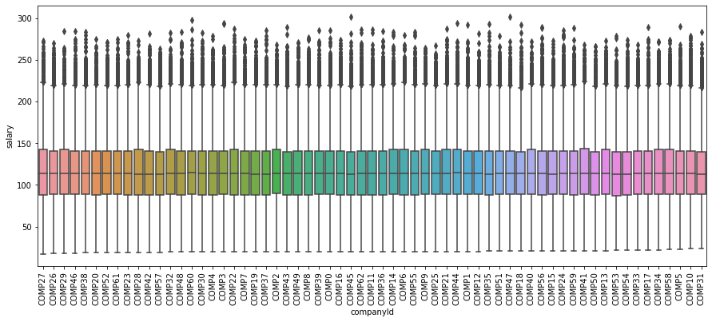
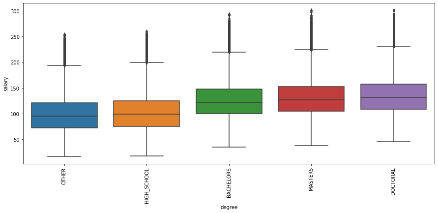
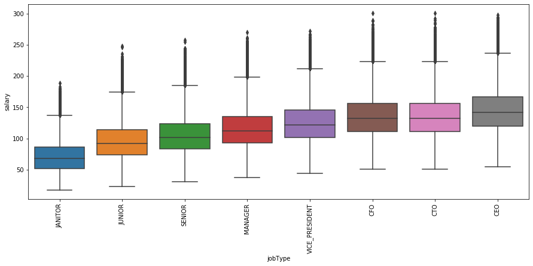
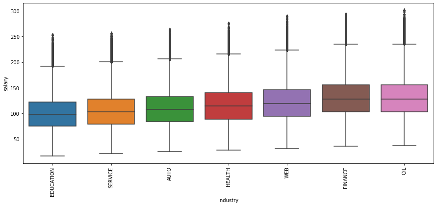
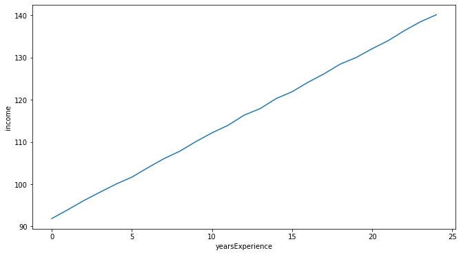
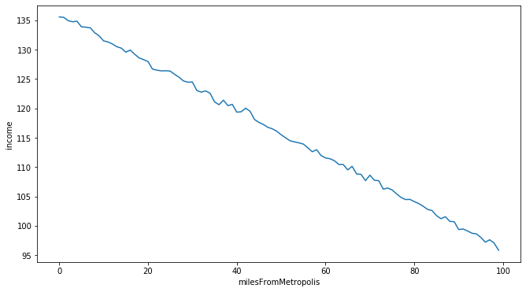

# Salary Prediction based on job description features
**Introduction**
For this salary prediction project, I examined different attributes of employee information to predict their salary.

 **Data** 
The data is part of an existing data set that includes employee information. The features of the dataset include job id, company id, job type, degree, major, industry, years experience and miles the employee lives from from the metropolitan city. The size of the dataset is 1,000,000 rows.

 **Different Features in the Dataset** 
 •	JobId 
 •	CompanyId 
 •	JobType 
 •	Industry 
 •	Degree 
 •	Major 
 •	Years of Experience 
 •	Miles from metropolis 
 •	Salary (Variable to predict) 

 **Preprocessing** 
For the data cleaning process, I followed the steps listed below:  
•	Removed 5 rows where salary equaled 0, which indicated missing values  
•	Removed the outliers, salaries in more than 75 percentile which constituted to 7117 rows i.e 0.7% of total data.   
•	Records with a degree and major listed as "None" were replaced with "OTHER"  

 **Exploratory Data Analysis** 
During the analysis of the dataset we where able to find out that there is not much variance across the different company id’s and hence can be ignored while building our model.  

 
From the image below we see that employees having doctoral degrees are paid more compared to other employees.  
 

The below box plot shows the comparison between salaries among different job positions. And from the plot we can say that C-level executives are paid more compared to others.  

 
Is there a difference in salary among different industries? Yes, there is from the box plot we see that the Oil and finance industry are paid more compared to other industries.   

Salaries tend to increase as years of experience increases to test this we plot a line graph of salary vs years of experience and from the plot below we see that salary and years of experience are linearly dependent.  
 
 
 
The line plot below also shows almost a linear relationship between miles from metropolis and salary but in this case as the miles increases from metropolitan area salary decreases.  

 
 **Modeling**   
After examining the data, I removed outliers below the 25th and above the 75th percentile, keeping the inter quartile range. This resulted in 992,418 records in our dataset.    
 After reviewing the EDA process, I established the following features as predictors for training the model:     
•	Removed Company Id as there was not much variance among the companies and hence would not affect the result.   
•	Selected jobType, degree, major, industry, miles from metropolitan and years of experience.  
•	Encoded all categorical variables.(using dummy variables).  
•	This brought us to a total of 31 predictors.  

The regression models used to predict our result was Linear Regression, Random Forest regression and Gradient Boosting Regressor.
| Model	                    |Performance	|Performance(After Tuning) |
|---------------------------|:-----------:|-------------------------:|
|Linear Regression 	        | 384(MSE)	  | 384(MSE)                 |
|Random Forest Regressor 	  | 464(MSE) 	  | 367(MSE)                 | 
|Gradient Boosting Regressor| 375(MSE)	  | 356(MSE)                 |

 Hyperparameter tuning was performed using GridSearch CV, and the best values for a parameter was selected. (Parameter tuning can also be performed with other parameters of the model, but my system was not able to support it. Hence was done only for a single parameter.)    
From the performance we see that Gradient Boosting Regressor performs better compared to the linear regression and random forest models.
The performance of linear regression can also be improved by using polynomial features which would help fit the non linear relationship between feature and a target(could not do this as my system was going for a toss)

**Summary**  

To end with we see that the Gradient Boosting Regressor model fits the data the best and is able to get a good error metric of 356 which is a very reasonable estimate as compared to our baseline error metric where we used the industry average perspective.  
We also created a pipeline that takes both the training and the test scripts and tunes the model and saves the test outcomes to a csv file.

Some features that the dataset can include for better predictions are :
•	Company Jumps: A person changing companies more frequently tends to have a higher salary due to hikes.
•	Years within the company also can be a good factor.
